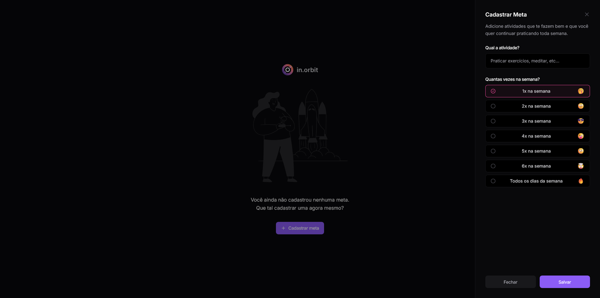
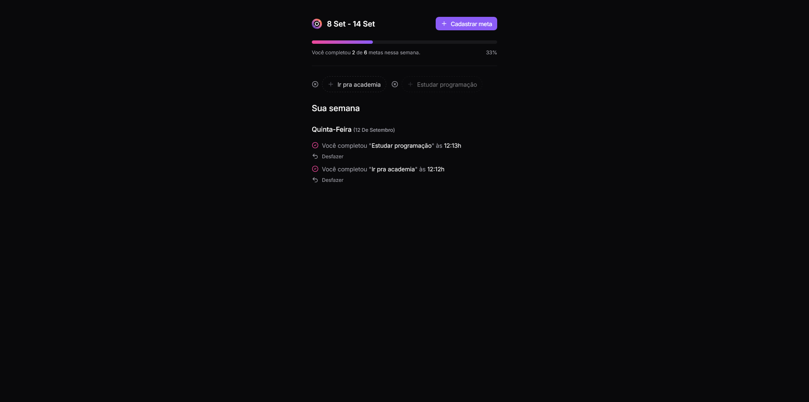

# In.Orbit

**Aplicação Fullstack para você organizar e cumprir suas metas do dia-a-dia!**

Esta aplicação foi desenvolvida durante a _sprint_ **NLW Pocket InOrbit**

## Tecnologias utilizadas:
- Typescript
- Tailwind CSS
- React
- React Hook Form
- Tanstack Query
- Zod

## Backend

### Tecnologias

- Typescript
- Drizzle ORM
- Zod
- Fastify
- PostgreSQL

